# HireLoop - Comprehensive Project Documentation & System Architecture

## 1. Project Overview

**HireLoop** is a modern, microservice-based **Smart Placement Platform** designed to empower students and job seekers during their campus and off-campus placement journeys. 

The platform bridges the gap between candidates (students) and experienced industry mentors/alumni (seniors) by offering:
- **Authentication & Role Management**: Multi-role user access (`student/user`, `senior/alumni`, `admin`) with secure JWT and session cookie management.
- **User & Senior Profiles**: Comprehensive profile management for education, skills, experience, and company affiliations.
- **Company Preparation Roadmaps**: Structured, multi-stage learning roadmaps with curated resources for target companies.
- **Mock Interview Booking**: Slot scheduling by seniors and booking by students with post-interview feedback and tracking.
- **Referral Management System**: End-to-end referral workflow enabling candidates to request job referrals from verified seniors.
- **ATS Resume Analyzer**: Automated PDF resume parser and keyword scoring engine to assess placement readiness and offer actionable recommendations.

---

## 2. Technical Stack & Architecture

HireLoop is built using a **Decoupled Microservices Architecture** behind an **API Gateway**, allowing services to scale independently.

```
[ React + Vite Frontend ] (Port 5173)
            |
            v  (HTTP / REST / Cookies)
[ Express API Gateway ] (Port 5000)
    |--------------+-------------------|
    v              v                   v
[ Auth Service ] [ Core Service ] [ ATS Service ]
 (Port 5001)     (Port 5002)      (Port 5003)
    |              |                   |
    +--------------+-------------------+
                   |
           [ MongoDB Database ]
```

### Stack Summary

| Layer | Technology Used |
| :--- | :--- |
| **Frontend** | React 18, Vite, React Router DOM v7, Tailwind CSS, Lucide Icons, Axios |
| **API Gateway** | Express.js, TypeScript, `http-proxy-middleware`, Helmet, Morgan, CORS |
| **Auth Service** | Node.js, Express.js, TypeScript, Mongoose (MongoDB), JWT, Bcrypt, Zod |
| **Core Service** | Node.js, Express.js, TypeScript, Mongoose (MongoDB), Pino HTTP Logger |
| **ATS Service** | Node.js, Express.js, TypeScript, Multer, `pdf-parse` |
| **Notification Service** | Node.js, Express.js (Event-driven notification placeholder) |
| **Containerization** | Docker, Docker Compose, Bridge Networking |

---

## 3. Directory Structure

```
HireLoop/
├── docker-compose.yml                 # Multi-container orchestrator configuration
├── README.md                          # Project introduction
├── gateway/                           # API Gateway service
│   ├── src/
│   │   ├── app.ts                     # Gateway Express app initialization & CORS
│   │   ├── server.ts                  # Server port listener
│   │   ├── config/                    # Environment variables mapping
│   │   ├── proxy/                     # Proxy middleware per target service
│   │   │   ├── auth.proxy.ts          # Auth service proxy (Port 5001)
│   │   │   ├── core.proxy.ts          # Core service proxy (Port 5002)
│   │   │   └── ats.proxy.ts           # ATS service proxy (Port 5003)
│   │   └── routes/
│   │       └── proxy.routes.ts        # Route proxy dispatch table
│   └── Dockerfile
├── services/                          # Microservices workspace
│   ├── auth-service/                  # User Authentication & Sessions
│   │   ├── src/
│   │   │   ├── controllers/           # register, login, refresh, logout
│   │   │   ├── models/                # User & Session Mongoose schemas
│   │   │   ├── services/              # Auth business logic & JWT handling
│   │   │   └── validators/            # Zod input validation schemas
│   │   └── Dockerfile
│   ├── core-service/                  # Core Business Domain Service
│   │   ├── src/
│   │   │   ├── controllers/           # Profile, Company, Referral, Interview controllers
│   │   │   ├── models/                # Profile, Company, Roadmap, Referral, Interview schemas
│   │   │   ├── routes/                # Domain API route handlers
│   │   │   └── services/              # Domain logic handlers
│   │   └── Dockerfile
│   ├── ats-service/                   # Resume Parsing & Keyword Scoring
│   │   ├── src/
│   │   │   ├── controllers/           # scoreText & uploadAndScoreResume
│   │   │   ├── routes/                # /score and /upload endpoints
│   │   │   └── services/              # pdf-parse text extractor & scoring algorithms
│   │   └── Dockerfile
│   └── notification-service/          # Push & email notification service (Placeholder)
├── frontend/                          # Client Web Application
│   ├── src/
│   │   ├── api/                       # Axios client pointing to API Gateway
│   │   ├── components/                # LandingPage & visual UI components
│   │   ├── pages/
│   │   │   ├── auth/                  # Login & Signup forms
│   │   │   └── dashboard/             # Interactive Candidate Dashboard
│   │   ├── App.jsx                    # Client route definitions
│   │   └── main.jsx                   # Entrypoint
├── shared/                            # Cross-service constants and utilities
└── backend/                           # Legacy monolithic Express server (Reference)
```

---

## 4. Subservices & Core Modules

### 4.1. API Gateway (`gateway/`)
- **Port**: `5000`
- **Role**: Entry point for all frontend traffic. Handles CORS verification, request logging, headers security (`helmet`), and reverse-proxies requests to internal microservices.
- **Routing Rules**:
  - `/api/auth/*` & `/api/v1/auth/*` ➔ `http://auth-service:5001`
  - `/api/profiles/*`, `/api/companies/*`, `/api/referrals/*`, `/api/interviews/*` ➔ `http://core-service:5002`
  - `/api/ats/*` ➔ `http://ats-service:5003`

### 4.2. Auth Service (`services/auth-service/`)
- **Port**: `5001`
- **Database**: MongoDB (`User` and `Session` collections)
- **Features**:
  - **Register**: Validates input schema via Zod, checks email uniqueness, hashes passwords with bcrypt, stores user (`user`, `senior`, or `admin`).
  - **Login**: Verifies credentials, generates short-lived JWT Access Tokens and persistent HTTP-only Refresh Token cookies.
  - **Token Refresh**: Rotates access tokens securely using session validation.
  - **Logout**: Clears session cookie and invalidates server-side session hash.

### 4.3. Core Service (`services/core-service/`)
- **Port**: `5002`
- **Database**: MongoDB (`Profile`, `Company`, `Roadmap`, `Referral`, `InterviewSlot`, `InterviewBooking` collections)
- **Features**:
  - **Profile Management**: Student & Senior profiles including university details, target companies, skills array, and experience years.
  - **Company Directories & Roadmaps**: Company registry linked with multi-stage interview preparation roadmaps (topics, resources, links).
  - **Mock Interviews**:
    - Seniors publish available time slots (`InterviewSlot`).
    - Students browse available slots and confirm bookings (`InterviewBooking`).
    - Post-interview feedback/notes recording and history tracking.
  - **Referrals System**:
    - Candidates apply for referrals attached to job titles/URLs.
    - Status lifecycle management: `PENDING` ➔ `ACCEPTED` / `REJECTED` ➔ `SUBMITTED` ➔ `COMPLETED`.

### 4.4. ATS Resume Service (`services/ats-service/`)
- **Port**: `5003`
- **Tech**: In-memory PDF buffer handling with `multer` and `pdf-parse`.
- **Scoring Engine Algorithm**:
  - **Keyword Matching (70% weight)**: Scans extracted resume text against core industry keywords (e.g., *JavaScript, React, Node, SQL, DSA, System Design, Docker, AWS*).
  - **Length & Depth Bonus (20% weight)**: Evaluates optimal word counts (300-1200 words).
  - **Structural Section Bonus (10% weight)**: Validates presence of essential resume headings (*Education, Experience, Projects, Skills*).
  - **Readiness Classification**: Assigns level tier (`Needs Work`, `Developing`, `Competitive`, `Placement Ready`) and generates actionable improvement tips.

---

## 5. End-to-End System Workflows

```mermaid
sequenceDiagram
    autonumber
    actor Candidate as Candidate / User
    participant FE as React Frontend
    participant GW as API Gateway (5000)
    participant Auth as Auth Service (5001)
    participant Core as Core Service (5002)
    participant ATS as ATS Service (5003)

    %% Authentication Flow
    rect rgb(20, 30, 50)
    note right of Candidate: 1. User Authentication Flow
    Candidate->>FE: Fill Registration / Login Form
    FE->>GW: POST /api/auth/login
    GW->>Auth: Proxy request to http://auth-service:5001/login
    Auth->>Auth: Validate Credentials & Create Session
    Auth-->>FE: Return Access Token + Set HTTP-only Cookie
    FE-->>Candidate: Redirect to Candidate Dashboard
    end

    %% ATS Resume Audit Flow
    rect rgb(30, 40, 30)
    note right of Candidate: 2. Resume Scan Workflow
    Candidate->>FE: Upload PDF Resume
    FE->>GW: POST /api/ats/upload
    GW->>ATS: Proxy request to http://ats-service:5003/upload
    ATS->>ATS: Parse PDF text & compute ATS readiness score
    ATS-->>FE: Return score, level, matched/missing keywords & tips
    FE-->>Candidate: Display Readiness Dashboard Card
    end

    %% Mock Interview Workflow
    rect rgb(40, 20, 40)
    note right of Candidate: 3. Mock Interview Booking Workflow
    Candidate->>FE: Select Senior & Available Time Slot
    FE->>GW: POST /api/interviews/book
    GW->>Core: Proxy request to http://core-service:5002/interviews/book
    Core->>Core: Update Slot status to BOOKED & create Booking record
    Core-->>FE: Return Confirmed Booking details
    FE-->>Candidate: Display Scheduled Session on Dashboard
    end

    %% Referral Request Workflow
    rect rgb(50, 40, 20)
    note right of Candidate: 4. Job Referral Request Workflow
    Candidate->>FE: Submit Referral Request (Job Title, URL, Note)
    FE->>GW: POST /api/referrals
    GW->>Core: Proxy request to http://core-service:5002/referrals
    Core->>Core: Create Referral Record (Status: PENDING)
    Core-->>FE: Return Referral Request object
    FE-->>Candidate: Show Pending Request in Referral Tracker
    end
```



---

## 6. API Endpoint Summary

### Auth Service (`/api/auth`)
- `POST /register` - Register a new user (`student` or `senior`)
- `POST /login` - User login & session creation
- `POST /refresh` - Refresh access token via session cookie
- `POST /logout` - Invalidate session & clear cookies

### Core Service (`/api/`)
- **Profiles**:
  - `POST /profiles` - Create candidate/senior profile
  - `GET /profiles/me` - Fetch authenticated user profile
  - `GET /profiles/:id` - Fetch user profile by ID
  - `PUT /profiles/me` - Update profile details
- **Companies & Roadmaps**:
  - `GET /companies` - List target hiring companies
  - `POST /companies` - Register company (Admin/Senior)
  - `GET /companies/:companyId/roadmap` - Get interview roadmap
  - `POST /companies/:companyId/roadmap` - Add roadmap stage/topics
- **Mock Interviews**:
  - `POST /interviews/slots` - Create availability slot (Senior)
  - `GET /interviews/slots` - Query available interview slots
  - `POST /interviews/book` - Reserve an interview slot (Student)
  - `PATCH /interviews/:id/complete` - Record interview feedback & mark complete
  - `GET /interviews/history/student` - View student mock interview history
- **Referrals**:
  - `POST /referrals` - Request referral from senior
  - `PATCH /referrals/:id/status` - Update referral state (`ACCEPTED`, `REJECTED`, etc.)
  - `GET /referrals/sent` - Query sent referral requests
  - `GET /referrals/received` - Query received referral requests (Senior)

### ATS Service (`/api/ats`)
- `GET /health` - ATS service healthcheck
- `POST /score` - Analyze raw text string against keyword dictionary
- `POST /upload` - Upload PDF resume for parsing and ATS scoring

---

## 7. Containerization & Execution

The system is configured for containerized deployment via Docker Compose.

```bash
# Start all microservices in background
docker-compose up -d --build

# Service Port Mappings:
# - API Gateway:      http://localhost:5000
# - Auth Service:     http://localhost:5001
# - Core Service:     http://localhost:5002
# - ATS Service:      http://localhost:5003
# - Frontend App:     http://localhost:5173
```
