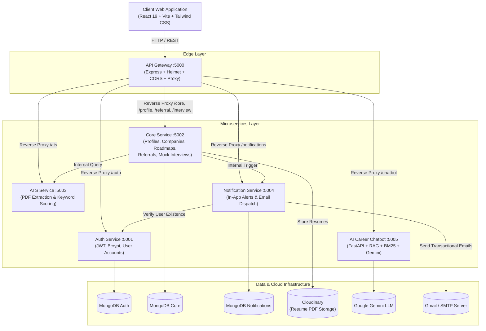
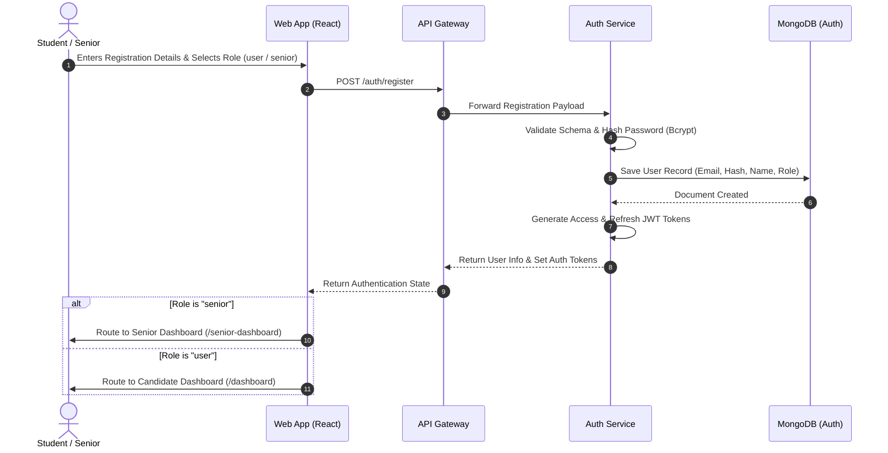
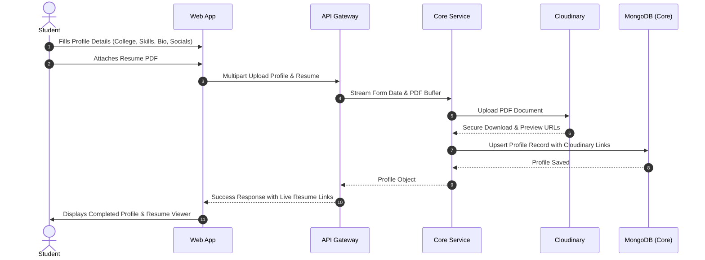
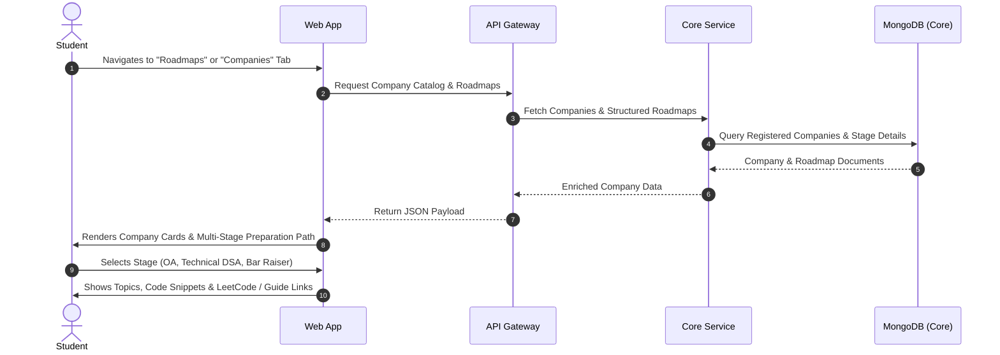
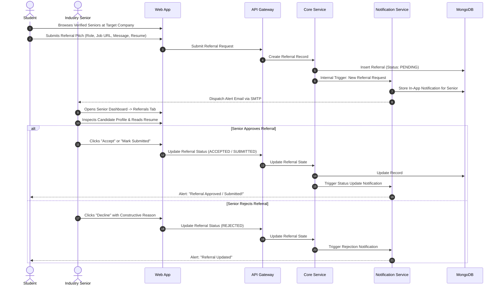
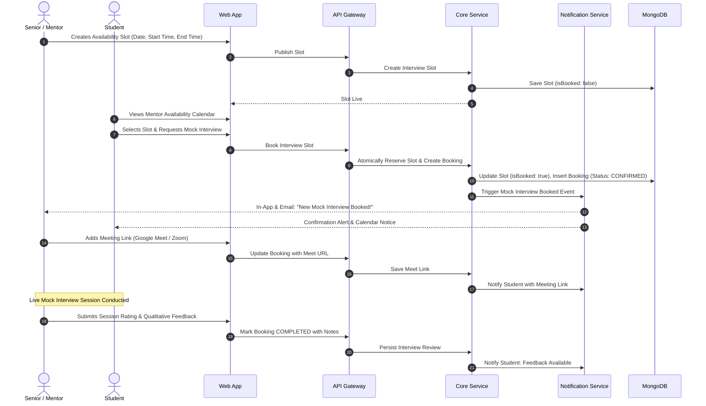
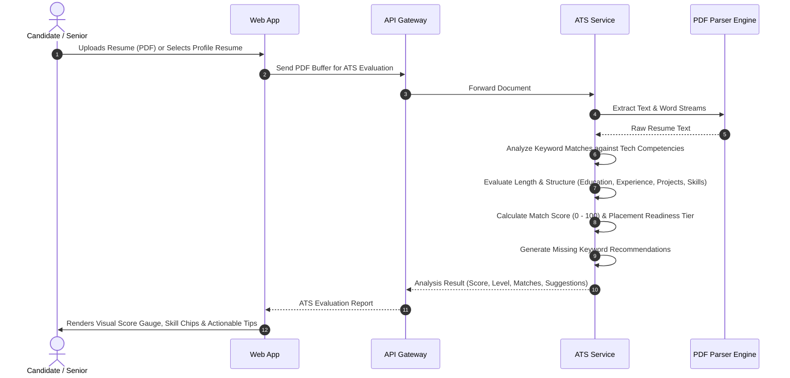
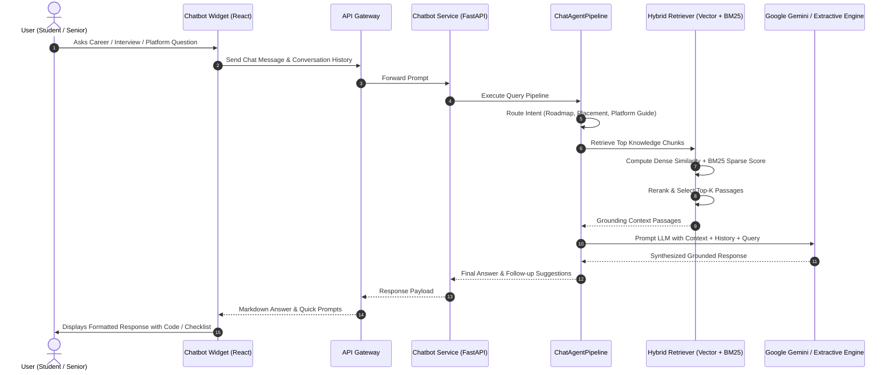
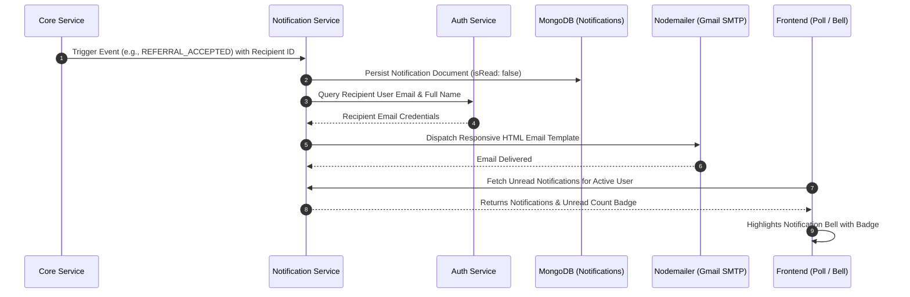

# 🚀 HireLoop — Smart Placement & Peer-to-Peer Career Platform

HireLoop is an end-to-end, microservices-driven placement acceleration ecosystem built to bridge the gap between ambitious students, job seekers, and verified industry seniors, mentors, and alumni. It streamlines campus-to-corporate career transitions through peer mentorship, company-specific preparation roadmaps, mock interview scheduling, employee job referrals, intelligent ATS resume evaluation, real-time notifications, and an autonomous AI Career Mentor.

---

## 📌 Table of Contents

- [Overview & Vision](#-overview--vision)
- [Key Problems HireLoop Solves](#-key-problems-hireloop-solves)
- [Target User Personas](#-target-user-personas)
- [Core Features & Functional Modules](#-core-features--functional-modules)
- [System Architecture](#-system-architecture)
- [End-to-End Project Workflows](#-end-to-end-project-workflows)
  - [1. User Authentication & Role Assignment Workflow](#1-user-authentication--role-assignment-workflow)
  - [2. Student Profile & Resume Cloud Management](#2-student-profile--resume-cloud-management)
  - [3. Company Exploration & Preparation Roadmaps](#3-company-exploration--preparation-roadmaps)
  - [4. Peer-to-Peer Job Referral Pipeline](#4-peer-to-peer-job-referral-pipeline)
  - [5. Mock Interview Scheduling & Evaluation Lifecycle](#5-mock-interview-scheduling--evaluation-lifecycle)
  - [6. Automated ATS Resume Screening & Analysis](#6-automated-ats-resume-screening--analysis)
  - [7. RAG-Powered AI Career Mentor Interaction](#7-rag-powered-ai-career-mentor-interaction)
  - [8. Multi-Channel Notification Dispatch](#8-multi-channel-notification-dispatch)
- [Technology Stack](#-technology-stack)
- [Microservices Breakdown](#-microservices-breakdown)
- [Project Directory Structure](#-project-directory-structure)
- [Getting Started & Local Development](#-getting-started--local-development)
  - [Prerequisites](#prerequisites)
  - [Running with Docker Compose](#running-with-docker-compose-recommended)
  - [Running Services Individually](#running-services-individually)
- [Security, Scalability & Best Practices](#-security-scalability--best-practices)
- [Future Roadmap](#-future-roadmap)

---

## 🌟 Overview & Vision

College students and early-career job seekers often face severe hurdles during placement season: fragmented preparation resources, lack of genuine industry guidance, cold-outreach dead ends for job referrals, and blind applications that get rejected by Applicant Tracking Systems (ATS).

**HireLoop** establishes a closed-loop network inside educational institutes and professional alumni communities:
1. **Democratizes Access to Mentors**: Students directly connect with verified seniors who work at top companies (e.g., Google, Microsoft, Amazon, Flipkart, Zomato).
2. **Standardizes Company Preparation**: Curates step-by-step technical roadmaps, covering Online Assessments (OA), technical DSA deep dives, system design, and behavioral Bar Raiser rounds.
3. **Streamlines Referrals**: Provides a transparent, structured referral pipeline with resume attachments, custom pitch notes, and live status tracking.
4. **Validates Readiness via Mock Interviews**: Enables seniors to open availability slots and students to book 1-on-1 interview practice sessions with actionable feedback.
5. **Empowers Candidates with AI**: Integrates an ATS engine for instant resume keyword and formatting optimization, plus a 24/7 AI mentor utilizing Retrieval-Augmented Generation (RAG) over curated career knowledge bases.

---

## 🎯 Key Problems HireLoop Solves

| Traditional Placement Challenges | HireLoop Solution |
| :--- | :--- |
| **Cold Outreach Frustration**: Candidates message hundreds on LinkedIn with single-digit response rates. | **In-Platform Senior Directory**: Direct channel to verified seniors motivated to review referral pitches and mentor juniors. |
| **Unstructured Preparation**: Students guess what topics or questions are asked by specific companies. | **Structured Company Roadmaps**: Multi-stage, role-specific roadmaps outlining assessment topics, curated problems, and resources. |
| **Interview Anxiety & Lack of Practice**: First technical interview is often at the actual dream company. | **1-on-1 Mock Interview Booking**: Practice live with alumni already working in target companies; receive structured feedback. |
| **Black-box ATS Rejections**: Resumes rejected by screening bots without feedback. | **Instant ATS Scoring Engine**: Computes ATS match scores, highlights missing skills, and suggests improvements prior to applying. |
| **Delayed Information & Lost Opportunities**: Updates buried in emails or missed messages. | **Synchronous & Asynchronous Alerts**: In-app bell notifications and automated email dispatches keep all parties synchronized. |

---

## 👥 Target User Personas

### 1. Student / Junior Candidate (Job Seeker)
- Builds a comprehensive engineering profile with education, GitHub, LinkedIn, technical stack, and verified PDF resumes.
- Discovers top hiring organizations, open roles, and company interview stages.
- Connects with seniors for internal job referrals and tracks application statuses in real time.
- Books mock interview sessions according to mentor availability to refine problem-solving and communication.
- Uses the ATS resume screener to optimize keyword match ratios before submitting applications.
- Chats with the AI Career Agent for instantaneous roadmap navigation, preparation advice, and placement questions.

### 2. Senior / Alum / Mentor (Industry Professional)
- Configures professional credentials, company affiliation, role, domain expertise, and years of experience.
- Reviews incoming referral requests with student profiles and hosted resumes; accepts, rejects, forwards, or marks them as submitted.
- Publishes flexible interview calendar slots (date, start time, end time).
- Conducts live mock interviews, shares video meeting links, and provides structured qualitative feedback.
- Screens resumes using the built-in ATS utility to evaluate prospective candidates efficiently.

### 3. Administrator
- Oversees platform health, monitors system integrity, manages user verification, and maintains company and roadmap master data.

---

## 🚀 Core Features & Functional Modules

### 🔍 Company Discovery & Preparation Roadmaps
- Directory of premier technology companies, complete with industry categorization, office locations, official career portals, and current active roles.
- Stage-by-stage interview guides: Online Coding Assessments, System Design, Data Structures & Algorithms rounds, and Behavioral / Leadership rounds.
- Curated practice questions, external reference materials, and company-specific tips.

### 🤝 Peer Referral Management System
- Students can browse verified seniors by company and send targeted referral requests.
- Requests include the target job title, job post URL, candidate resume, and a personalized pitch.
- Full lifecycle status transitions: `PENDING`, `ACCEPTED`, `REJECTED`, `SUBMITTED`, `COMPLETED`, `CANCELLED`.
- Dual notifications: Immediate in-app alert and transactional email to the recipient.

### 📅 Mock Interview Scheduling Engine
- Seniors declare and publish availability slots in their local timezone.
- Students view open slots across mentors and confirm bookings with a single click.
- Automatic collision prevention (unique slot reservations) and status tracking (`CONFIRMED`, `COMPLETED`, `CANCELLED`, `NO_SHOW`).
- Integrated virtual meeting links (Google Meet, Zoom, etc.) and post-session feedback.

### 📄 Intelligent ATS Resume Screener
- Fast client-side and server-side PDF document parsing.
- Keyword evaluation against industry core competencies: Full Stack, Frontend, Backend, Databases, Cloud & DevOps, Data Structures, System Design, and Testing.
- Section completeness validation (Education, Experience, Projects, Skills) and word count optimization analysis.
- Tiered scoring: *Needs Work*, *Developing*, *Competitive*, or *Placement Ready*, accompanied by missing skill recommendations.

### 🤖 Hybrid RAG AI Career Mentor
- Conversational AI widget accessible across all authenticated views.
- Hybrid retrieval architecture combining Dense Semantic Embeddings and Sparse BM25 lexical search for domain grounding.
- Grounded on curated knowledge bases: placement records, roadmaps, interview guides, and platform usage manuals.
- Generates contextual responses using Google Gemini with dynamic fallback synthesis.

### 🔔 Multi-Channel Notification Hub
- Unread badge counter and real-time popover dropdown inside the application header.
- Automated email notifications dispatched via secure SMTP for critical lifecycle events (referral updates, interview confirmations).

---

## 🏗️ System Architecture

HireLoop follows a clean, decoupled microservices architecture coordinated through a centralized API Gateway and containerized via Docker Compose.



---

## 🔄 End-to-End Project Workflows

### 1. User Authentication & Role Assignment Workflow



**Workflow Description**:
1. Users register with first name, last name, email, password, and their designated role (`user` for students/candidates or `senior` for working professionals/alumni).
2. The Auth Service hashes passwords with Bcrypt, establishes secure token sessions, and returns user identity metadata.
3. The frontend `ProtectedRoute` and `PublicRoute` guards automatically route the authenticated session to either the student dashboard or the senior dashboard based on verified claims.

---

### 2. Student Profile & Resume Cloud Management



**Workflow Description**:
1. Students complete their academic profile: university, graduation year, degree, bio, GitHub, LinkedIn, and core skills.
2. The student uploads a PDF resume. The Core Service processes the file buffer using Multer and streams it directly to Cloudinary cloud storage.
3. Secure viewing and downloading URLs are stored in the user profile document, allowing mentors to review resumes without local file exposure.

---

### 3. Company Exploration & Preparation Roadmaps



**Workflow Description**:
1. Students browse top hiring partners (Google, Microsoft, Amazon, Flipkart, Zomato, etc.) with metadata on open roles and headquarters.
2. Selecting any company reveals a comprehensive multi-stage preparation curriculum.
3. Each stage outlines interview objectives, required technical topics (e.g., Two Pointers, Dynamic Programming, Graphs, System Architecture, Leadership Principles), and curated practice links.

---

### 4. Peer-to-Peer Job Referral Pipeline



**Workflow Description**:
1. **Discovery**: A student identifies an alum or senior working at their target company.
2. **Request Submission**: The student submits a referral request containing the job title, job requisition link, resume URL, and a customized introductory note.
3. **Notification**: The Core Service flags the referral as `PENDING` and triggers an asynchronous event to the Notification Service, alerting the senior via in-app banner and transactional email.
4. **Evaluation**: The senior opens their referral management tab, examines the applicant's credentials and resume, and takes action:
   - `ACCEPTED`: Agrees to submit the referral.
   - `SUBMITTED`: Confirms submission into the corporate portal.
   - `REJECTED`: Declines with optional feedback.
5. **Feedback Loop**: Any status transition triggers instant notifications back to the student.

---

### 5. Mock Interview Scheduling & Evaluation Lifecycle



**Workflow Description**:
1. **Slot Declaration**: Seniors open available time windows for mock interviews.
2. **Booking Reservation**: Students search open slots by mentor and confirm reservations; the slot is locked atomically to prevent double bookings.
3. **Coordination**: Both parties receive scheduling notifications. The senior provides a live meeting link (Google Meet, Zoom, Microsoft Teams).
4. **Session & Evaluation**: After conducting the mock interview, the senior submits ratings, strengths, and areas for improvement, enabling students to iterate before real hiring rounds.

---

### 6. Automated ATS Resume Screening & Analysis



**Workflow Description**:
1. The user uploads a resume or scores an existing profile document.
2. The ATS Service extracts text using `pdf-parse` and checks it against core technology domains (languages, frontend, backend, databases, cloud, system design, testing).
3. The engine scores keyword frequency, evaluates section completeness, and assesses document length.
4. The output delivers a numerical score (0-100), placement category (*Placement Ready*, *Competitive*, *Developing*, or *Needs Work*), matched vs. missing keywords, and tailored recommendations.

---

### 7. RAG-Powered AI Career Mentor Interaction



**Workflow Description**:
1. **Interactive Query**: Users interact with the floating AI widget from any page.
2. **Intent Routing**: The agent classifies the intent (e.g., company interview stages, DSA problem-solving tips, resume guidance, or platform navigation).
3. **Hybrid Information Retrieval**: The query searches across knowledge sources using combined dense embeddings and sparse BM25 retrieval.
4. **Contextual Generation**: Google Gemini (or the built-in fallback semantic synthesizer) produces clear, formatted, and hallucination-free career advice.

---

### 8. Multi-Channel Notification Dispatch



**Workflow Description**:
1. Key events (referrals, interview bookings, feedback) trigger internal notification requests.
2. The Notification Service saves the record for in-app display and looks up recipient details via the Auth Service.
3. A formatted HTML transactional email is dispatched via SMTP, ensuring users never miss important updates even while offline.

---

## 💻 Technology Stack

### Frontend Application
- **Core Framework**: React 19, Vite
- **Styling & UI**: Tailwind CSS v4, Lucide React (modern icon suite), Custom CSS glassmorphic components
- **Routing**: React Router DOM v7 (Public and Protected Route wrappers)
- **Animations**: Framer Motion
- **HTTP Client**: Axios (configured with interceptors and base gateway URLs)
- **Real-time Client**: Socket.io-client

### API Gateway
- **Runtime**: Node.js, Express, TypeScript
- **Security**: Helmet (relaxed CSP for cross-origin assets), CORS origin validation
- **Routing & Proxy**: Express HTTP Proxy to delegate traffic transparently to microservices
- **Logging**: Morgan HTTP request logger

### Microservices Backend
- **Auth Service**: Node.js, Express, TypeScript, Bcrypt password hashing, JSON Web Tokens (Access + Refresh tokens), Mongoose
- **Core Service**: Node.js, Express, TypeScript, Mongoose, Multer (memory storage), Cloudinary SDK (cloud file hosting), Zod validation, Pino logger
- **ATS Service**: Node.js, Express, TypeScript, `pdf-parse`, `pdf-lib`, algorithmic keyword matrix and scoring analyzer
- **Notification Service**: Node.js, Express, TypeScript, Mongoose, Nodemailer with SMTP transport, responsive email templates
- **Chatbot Service**: Python 3.11+, FastAPI, Uvicorn, Pydantic, Scikit-learn, NumPy, Google Generative AI (Gemini 1.5 Flash), BM25 & cosine similarity hybrid retrieval

### Persistence & Cloud Infrastructure
- **Databases**: MongoDB (distributed document stores)
- **Cloud Storage**: Cloudinary (secure cloud hosting of candidate resumes)
- **AI/LLM**: Google Gemini API
- **Containerization**: Docker, Dockerfile per service, Docker Compose

---

## 📦 Microservices Breakdown

| Service | Technology | Port | Primary Responsibility |
| :--- | :--- | :--- | :--- |
| **API Gateway** | Express / TS | `5000` | Unified edge reverse proxy, security headers, CORS policy, health aggregation |
| **Auth Service** | Express / TS | `5001` | User registration, authentication, JWT tokens, session state, user roles |
| **Core Service** | Express / TS | `5002` | User profiles, company catalog, roadmaps, referral requests, mock interview slots |
| **ATS Service** | Express / TS | `5003` | Resume PDF parsing, technical keyword extraction, scoring and recommendations |
| **Notification Service** | Express / TS | `5004` | In-app notification feed, read/unread state, background transactional email dispatch |
| **Chatbot Service** | FastAPI / Python | `5005` | RAG pipeline, BM25 + vector hybrid retriever, Google Gemini career mentor |
| **Frontend Web** | React 19 / Vite | `5173` | Responsive web application for candidate and senior dashboard experiences |

---

## 📂 Project Directory Structure

```text
HireLoop/
├── docker-compose.yml              # Multi-container orchestration specification
├── README.md                       # Comprehensive project documentation
├── gateway/                        # Central reverse proxy API Gateway
│   ├── Dockerfile
│   ├── package.json
│   ├── tsconfig.json
│   └── src/
│       ├── app.ts                  # Gateway Express configuration & security
│       ├── server.ts               # Server startup listener
│       ├── config/                 # Environment configuration
│       ├── proxy/                  # Microservice proxy delegates
│       └── routes/                 # Route forwarding definitions
├── services/                       # Independent microservices
│   ├── auth-service/               # Identity, Auth, JWT & Users
│   │   ├── Dockerfile
│   │   ├── package.json
│   │   └── src/
│   │       ├── models/             # User and Session Mongoose schemas
│   │       ├── controllers/        # Auth logic
│   │       └── routes/             # Registration, Login, Session routes
│   ├── core-service/               # Profiles, Referrals, Interviews, Roadmaps
│   │   ├── Dockerfile
│   │   ├── package.json
│   │   └── src/
│   │       ├── models/             # Profile, Company, Referral, Slot, Booking
│   │       ├── controllers/        # Domain business logic
│   │       └── routes/             # Core entity routes
│   ├── ats-service/                # Resume parsing & ATS scoring
│   │   ├── Dockerfile
│   │   ├── package.json
│   │   └── src/
│   │       ├── controllers/        # Scoring handlers
│   │       └── services/           # PDF extraction & keyword algorithm
│   ├── notification-service/       # In-app alerts & SMTP email dispatch
│   │   ├── Dockerfile
│   │   ├── package.json
│   │   └── src/
│   │       ├── models/             # Notification schema & type enums
│   │       ├── services/           # Nodemailer transport & notification logic
│   │       └── routes/             # User notification feeds
│   └── chatbot-service/            # AI Career Agent & RAG Engine
│       ├── Dockerfile
│       ├── requirements.txt
│       └── app/
│           ├── main.py             # FastAPI entrypoint & lifecycle
│           ├── agent/              # Pipeline, Intent router, Generator
│           ├── ml/                 # Embeddings, BM25, Hybrid retriever, Reranker
│           ├── knowledge/          # Placement data, roadmaps & platform guides
│           └── routes/             # Chat execution & health check routes
├── frontend/                       # Client web application
│   ├── Dockerfile
│   ├── package.json
│   ├── vite.config.js
│   └── src/
│       ├── App.jsx                 # Route navigation & role-based protection
│       ├── components/             # Landing page, Chatbot widget, Notification bell
│       ├── pages/
│       │   ├── auth/               # Login & Sign-up pages
│       │   └── dashboard/          # Student Dashboard & Senior Dashboard
│       ├── context/                # Auth context & global state
│       └── api/                    # Centralized client HTTP requests
└── shared/                         # Shared constants and utility definitions
```

---

## 🛠️ Getting Started & Local Development

### Prerequisites
- **Node.js** (v18.x or higher) and **npm**
- **Python** (v3.11 or higher) for local chatbot development
- **MongoDB** instance (local MongoDB server or MongoDB Atlas URI)
- **Docker** and **Docker Compose** (for containerized execution)
- **Cloudinary Account** (for resume storage credentials)
- *(Optional)* **Google Gemini API Key** and **Gmail App Password** (for full AI and email features)

---

### Running with Docker Compose (Recommended)

Docker Compose starts the entire ecosystem (Gateway, Auth, Core, ATS, Notification, Chatbot, and Frontend) with a single command:

1. **Clone the repository**:
   ```bash
   git clone https://github.com/anuragsharma2512/HireLoop.git
   cd HireLoop
   ```

2. **Configure Environment Files**:
   Create `.env` files in each service directory using the provided `.env.example` templates:
   - `gateway/.env`
   - `services/auth-service/.env`
   - `services/core-service/.env`
   - `services/ats-service/.env`
   - `services/notification-service/.env`
   - `services/chatbot-service/.env`

3. **Build and Launch All Containers**:
   ```bash
   docker-compose up --build
   ```

4. **Access the Application**:
   - **Frontend Web UI**: `http://localhost:5173`
   - **API Gateway**: `http://localhost:5000`

---

### Running Services Individually

If you prefer to run services manually for local development:

#### 1. Start the API Gateway
```bash
cd gateway
npm install
npm run dev
```

#### 2. Start the Auth Service
```bash
cd services/auth-service
npm install
npm run dev
```

#### 3. Start the Core Service
```bash
cd services/core-service
npm install
npm run dev
```

#### 4. Start the ATS Service
```bash
cd services/ats-service
npm install
npm run dev
```

#### 5. Start the Notification Service
```bash
cd services/notification-service
npm install
npm run dev
```

#### 6. Start the AI Chatbot Service
```bash
cd services/chatbot-service
python 3.11 -m venv venv
# On Windows:
.\venv\Scripts\activate
# On macOS/Linux:
# source venv/bin/activate
pip install -r requirements.txt
uvicorn app.main:app --host 0.0.0.0 --port 5005 --reload
```

#### 7. Start the Frontend
```bash
cd frontend
npm install
npm run dev
```

---

## 🛡️ Security, Scalability & Best Practices

- **Separation of Concerns**: Microservices decouple authentication, business logic, resume parsing, notifications, and AI compute, allowing each service to scale independently.
- **Stateless Gateway Routing**: The gateway manages cross-origin policies and request proxying without retaining session state.
- **Secure Password Hashing**: Passwords are encrypted using Bcrypt with salt rounds before database storage.
- **Encrypted Token Management**: Dual-token pattern (Access Token + Refresh Token) with expiration cycles prevents session hijacking.
- **Safe Cloud Document Handling**: Resumes are streamed directly to Cloudinary via memory buffers, avoiding insecure temporary files on disk.
- **Resilient AI Fallback**: The Chatbot Service gracefully falls back to extractive semantic synthesis if the external Gemini API is unreachable or rate-limited.
- **Service-to-Service Secret Authentication**: Internal communications between the Core and Notification services are secured using an internal shared secret header.

---

## 🔮 Future Roadmap

- [ ] **Real-time Chat**: Direct peer-to-peer instant messaging between students and seniors using Socket.io.
- [ ] **Automated Video Conferencing**: In-platform WebRTC video calls with real-time audio transcription for mock interviews.
- [ ] **AI-Powered Pitch Generator**: Automated referral message optimization tailored to senior job descriptions.
- [ ] **Alumni Verification System**: Automated corporate domain email verification (`@company.com`) for senior mentors.
- [ ] **Placement Analytics Dashboard**: College placement cell view with aggregate placement statistics, offer ratios, and batch readiness metrics.

---

## 📄 License

This project is licensed under the ISC License.